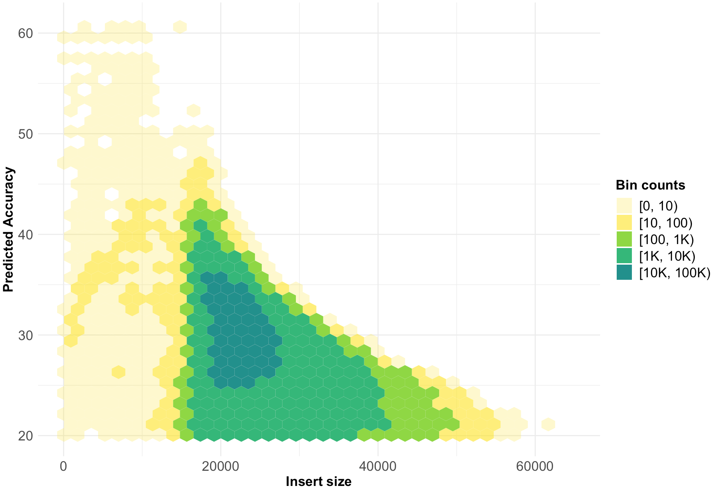

<h1 align="center">ggeyecandy</h1>

Various R scripts to generate appealing data visualizations

***

More scripts to follow over time!

## Custom hexplot
Hexplot for predicted accuracy vs insert size of one HiFi chip worth of Redwood data.

